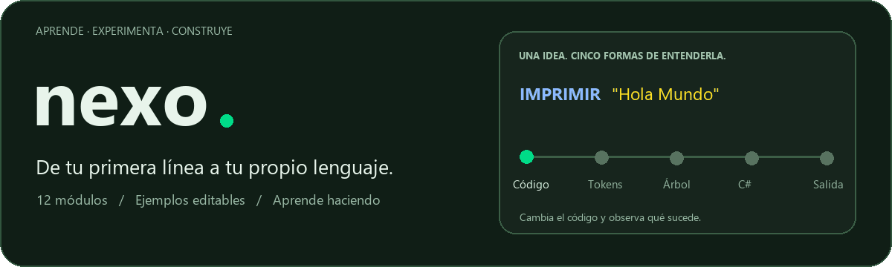
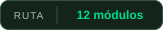
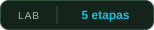
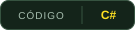
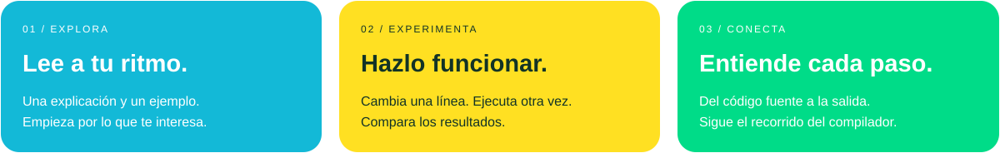
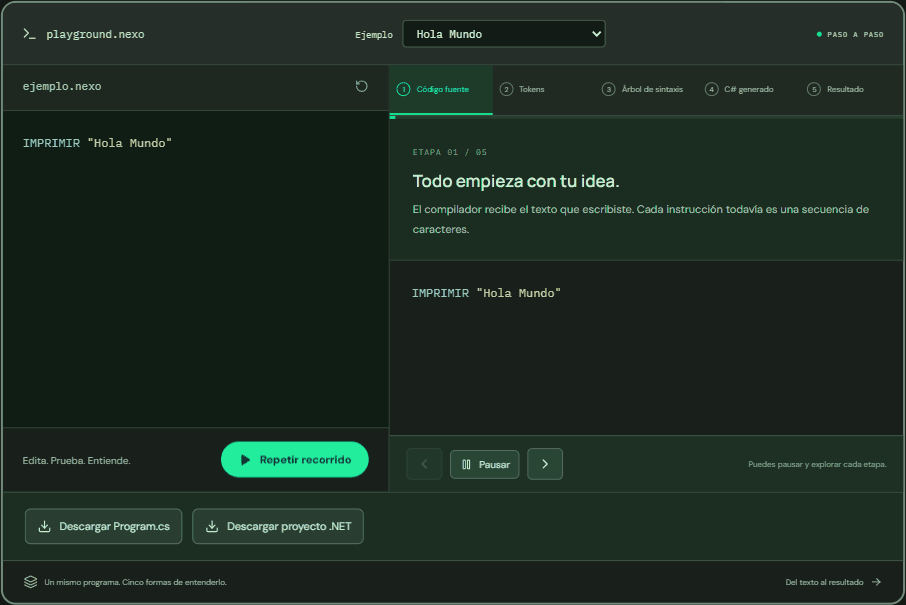
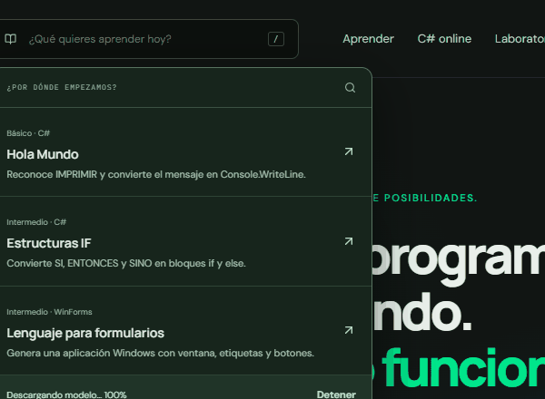
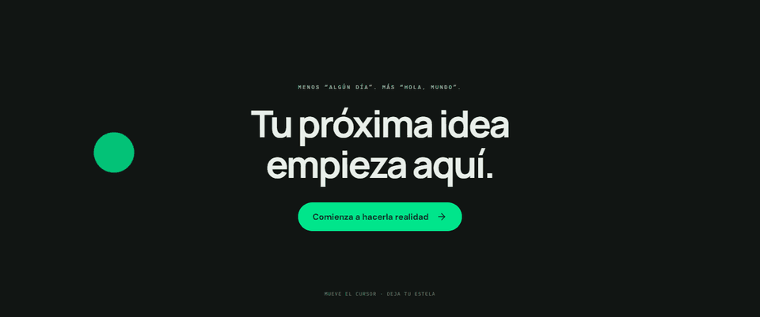
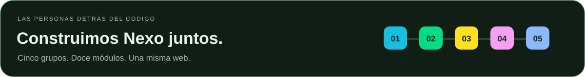
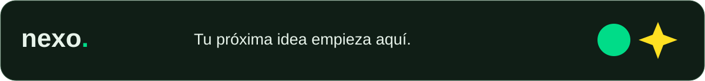

<div align="center">



**Un espacio para aprender programación y entender cómo funciona un compilador.**

<p>
<a href="#una-ruta-con-12-módulos"></a>
<a href="#mira-lo-que-pasa-entre-el-código-y-el-resultado"></a>
<a href="#un-editor-para-probar-c"></a>
<a href="#tu-idea-tiene-un-punto-de-partida"></a>
</p>

<p>


</p>

[La experiencia](#aprende-haciendo) · [Los módulos](#una-ruta-con-12-módulos) · [Guía Nexo](#tu-idea-tiene-un-punto-de-partida) · [Abrir la web](#abrir-la-web-en-tu-equipo)

</div>

## Aprende haciendo

En Nexo puedes empezar con un «Hola Mundo» y avanzar hasta construir un mini lenguaje. Cada tema tiene su propio espacio: una explicación, un ejemplo que puedes editar, ejercicios y un cuestionario para comprobar lo aprendido.

La idea es probar. Cambia una variable, modifica una condición o añade una repetición y observa cómo cambia el programa. Tu progreso queda guardado en el navegador para continuar después.



## Mira lo que pasa entre el código y el resultado

El laboratorio recorre cinco etapas del mismo programa:

**Código fuente → Tokens → Árbol de sintaxis → C# generado → Salida**

Puedes seguir la animación, pausar el recorrido y abrir cada etapa. Así puedes relacionar una instrucción con las piezas que reconoce el compilador y con el código que produce.



<sub>El laboratorio en funcionamiento: una misma instrucción vista desde cada etapa.</sub>

Por ejemplo:

```text
ENTERO puntos = 8
SI puntos >= 5 ENTONCES
    MOSTRAR "Objetivo alcanzado"
SINO
    MOSTRAR "Sigue practicando"
FINSI
```

Cambia `puntos` a `3` y vuelve a ejecutar. La condición toma el otro camino y el mensaje cambia.

<details>
<summary><strong>Abre el ejemplo: una línea, dos resultados</strong></summary>

| Valor de `puntos` | Condición `puntos >= 5` | Mensaje |
| --- | --- | --- |
| `8` | Verdadera | Objetivo alcanzado |
| `3` | Falsa | Sigue practicando |

Prueba también con `5`: el operador `>=` incluye el límite. En el laboratorio puedes abrir el árbol y seguir la decisión hasta la salida.

</details>

## Una ruta con 12 módulos

| | Módulo | Lo que vas a practicar |
| --- | --- | --- |
| 01 | Hola Mundo | Reconocer una instrucción y mostrar un mensaje |
| 02 | Operaciones matemáticas | Entender expresiones y precedencia |
| 03 | Variables | Guardar valores y trabajar con tipos |
| 04 | Calculadora | Combinar suma, resta, multiplicación y división |
| 05 | Mensajes personalizados | Construir textos y mostrarlos |
| 06 | Estructuras IF | Tomar decisiones con condiciones |
| 07 | Ciclos | Repetir instrucciones |
| 08 | Pseudocódigo a C# | Traducir un programa al lenguaje de destino |
| 09 | Formularios | Describir ventanas, etiquetas y botones |
| 10 | Consultas simples | Buscar datos mediante condiciones |
| 11 | Configuración | Generar documentos JSON y XML |
| 12 | Mini lenguaje | Reunir variables, operadores, decisiones, ciclos e impresión |

Puedes seguir el orden o usar el buscador **«¿Qué quieres aprender hoy?»** para encontrar un tema.

<div align="center">



</div>

**Tu primera visita:** empieza en Hola Mundo, cambia el mensaje y ejecuta. Después abre los tokens para ver cómo se reconoce lo que escribiste.

## Tu idea tiene un punto de partida

**Guía Nexo** acompaña la navegación. Cuéntale qué quieres aprender o construir y busca lecciones relacionadas. Dentro de una lección también puede iniciar el ejemplo, pausarlo o mostrar una etapa.

El panel tiene dos espacios: **Explorar**, para buscar temas, y **Mi idea**, para conversar. Puedes cerrar el panel y volver sin cancelar la respuesta en curso. El chat conserva la conversación y presenta el código con colores, sangría y un botón para copiar.

La guía se prepara automáticamente. Su primera carga descarga archivos que el navegador puede reutilizar en las siguientes visitas. La conversación se procesa en tu dispositivo; su velocidad y disponibilidad dependen de la memoria y del navegador. No consulta internet y sus respuestas pueden contener errores.

## Un editor para probar C#

El editor de C# permite cambiar el código, proporcionar datos de entrada y ejecutar el programa. La salida y los diagnósticos aparecen separados para que puedas identificar qué ocurrió.

Las lecciones usan un simulador educativo; el editor de C# utiliza un servicio externo, Wandbox, al que se envía el programa para ejecutarlo. Necesita conexión y su disponibilidad depende de ese servicio.

## Una web que también se mueve contigo

Las tarjetas acompañan el desplazamiento y las secciones aparecen al avanzar por la página. En el cierre, una estela de figuras sigue el cursor y se desvanece.



| Un detalle | Dónde lo encuentras |
| --- | --- |
| Tarjetas en movimiento | Al recorrer la portada |
| Estela de figuras | Al mover el cursor en la sección final |
| Recorrido paso a paso | Al ejecutar los ejemplos del laboratorio |
| Código con colores | En los editores y las respuestas de la guía |
| Tu avance guardado | Al volver a las lecciones desde el mismo navegador |

## El equipo de Nexo



| Grupo | Integrantes | Módulos a cargo |
| --- | --- | --- |
| **01 · Grupo 1** | Daniela, Aaron y Euris | **01** Hola Mundo · **06** Estructuras IF · **09** Lenguaje para formularios |
| **02 · Grupo 2** | Diego, Franklin y Gil | **02** Operaciones matemáticas · **07** Ciclos · **12** Mini lenguaje de programación completo |
| **03 · Grupo 3** | Ana y Josimar | **03** Variables · **10** Consultas simples |
| **04 · Grupo 4** | Karen y Zachrison | **04** Calculadora · **11** Lenguaje de configuración |
| **05 · Grupo 5** | Miguel Mes, Alonso y Carlos | **05** Mensajes personalizados · **08** Pseudocódigo a C# |
| **Landing Page** | Franklin |  |

<details>
<summary><strong>¿Quieres abrir los compiladores en Visual Studio?</strong></summary>

La web incluye [doce proyectos C# independientes](./proyectos-visual-studio/README.md), cada uno con sus ejemplos, documentación y captura de funcionamiento. Necesitan Visual Studio 2022 17.8 o posterior y el SDK .NET 8. Los formularios WinForms se ejecutan en Windows.

</details>

<br>

<div align="center">


</div>
