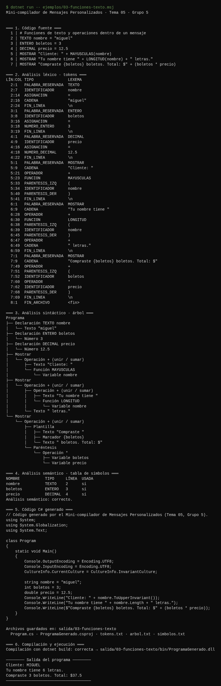

# Tema 05 · Compilador de Mensajes Personalizados

Taller colaborativo de Compiladores · Universidad Interamericana de Panamá.

**Grupo 5:** Miguel Mes, Alonso Pinzón y Carlos Contreras.  
**Docente:** Ricardo Wong.  
**Responsable de este tema:** Miguel Mes.

Este mini-compilador recibe un lenguaje pequeño en español para armar mensajes con texto y variables, y lo traduce a un programa de consola en C#. Después compila ese programa con el SDK de .NET y lo ejecuta, así que se ve el recorrido completo: del código fuente al mensaje que aparece en pantalla.

```text
Código fuente → Tokens → Árbol sintáctico → Revisión semántica → C# generado → dotnet build → Salida
```



## 1. Requisitos

- SDK de .NET 8 o posterior (`dotnet --list-sdks`).
- Visual Studio 2022 17.8 o posterior es opcional. También funciona desde PowerShell, la terminal de Linux/macOS o un Codespace.
- No necesita paquetes NuGet.

## 2. Cómo ejecutarlo

### Visual Studio 2022

1. Abrir `MiniCompiladorMensajes.sln`.
2. Ejecutar con `Ctrl + F5`.
3. Elegir uno de los ejemplos del menú o escoger `0` para escribir un programa propio. Se termina con `EJECUTAR` en una línea sola.

### Terminal

Desde esta carpeta:

```powershell
dotnet run                                              # menú interactivo
dotnet run -- ejemplos/01-bienvenida.msj                # compila y ejecuta
dotnet run -- ejemplos/04-tarjeta-interactiva.msj       # pide datos al usuario
dotnet run -- ejemplos/02-plantilla.msj --solo-traducir # solo genera el C#
dotnet run -- --probar                                  # 27 pruebas automáticas
```

Cada compilación correcta deja sus archivos en `salida/<nombre-del-ejemplo>/`:

| Archivo | Contenido |
| --- | --- |
| `Program.cs` | Código C# generado. |
| `ProgramaGenerado.csproj` | Proyecto .NET para compilar ese código. |
| `tokens.txt` | Resultado del análisis léxico. |
| `arbol.txt` | Árbol sintáctico. |
| `simbolos.txt` | Tabla de símbolos del análisis semántico. |
| `bin/ProgramaGenerado.dll` | Programa compilado (en Windows también se genera `ProgramaGenerado.exe`). |

La carpeta `salida/` está en `.gitignore` porque se genera en cada ejecución.

## 3. El lenguaje

Una instrucción por línea. Las palabras reservadas van en mayúsculas y los comentarios empiezan con `#` o `//`.

```text
TEXTO nombre = "Ana"
ENTERO edad = 21
MOSTRAR "Hola, " + nombre + ". Tienes " + edad + " años."
MOSTRAR "Hola {nombre}, el próximo año tendrás " + (edad + 1) + "."
```

| Instrucción | Ejemplo | Traducción a C# |
| --- | --- | --- |
| Declarar texto | `TEXTO nombre = "Ana"` | `string nombre = "Ana";` |
| Declarar entero | `ENTERO edad = 21` | `int edad = 21;` |
| Declarar decimal | `DECIMAL precio = 12.5` | `double precio = 12.5;` |
| Declarar sin valor | `TEXTO ciudad` | `string ciudad = "";` |
| Asignar | `nombre = "Luis"` | `nombre = "Luis";` |
| Mostrar | `MOSTRAR "Hola, " + nombre` (o `IMPRIMIR`) | `Console.WriteLine("Hola, " + nombre);` |
| Plantilla | `MOSTRAR "Hola {nombre}"` | `Console.WriteLine($"Hola {nombre}");` |
| Pedir un dato | `PEDIR nombre "¿Cómo te llamas?"` (o `LEER`) | `Console.ReadLine()` con validación según el tipo |
| Mayúsculas | `MAYUSCULAS(nombre)` | `nombre.ToUpperInvariant()` |
| Minúsculas | `MINUSCULAS(nombre)` | `nombre.ToLowerInvariant()` |
| Longitud | `LONGITUD(nombre)` | `nombre.Length` |

Reglas que revisa el compilador:

- Toda variable se declara antes de usarse y su nombre no se repite.
- `+` une textos. Si uno de los lados es texto, el número se convierte en texto: `"Edad: " + edad`. Si los dos lados son números, suma.
- `-`, `*` y `/` solo funcionan con números. Para incluir una operación dentro de un mensaje conviene usar paréntesis: `"Total: " + (precio * cantidad)`.
- Un `DECIMAL` acepta un entero, pero un `ENTERO` no acepta un decimal ni un texto.
- En una plantilla, cada `{variable}` debe existir. `{{` y `}}` muestran llaves literales.
- Escapes admitidos dentro de las cadenas: `\"`, `\\`, `\n`, `\t`.
- `PEDIR` sobre un `ENTERO` o `DECIMAL` vuelve a preguntar hasta recibir un número válido.

La gramática formal está en [docs/gramatica.md](docs/gramatica.md).

## 4. Fases implementadas

| Fase | Archivo | Qué hace |
| --- | --- | --- |
| Análisis léxico | `Compilador/AnalizadorLexico.cs` | Recorre el texto carácter por carácter y produce tokens con tipo, lexema, línea y columna. Detecta símbolos desconocidos, cadenas sin cerrar y escapes inválidos. |
| Análisis sintáctico | `Compilador/AnalizadorSintactico.cs` | Parser descendente recursivo con precedencia (`*` `/` antes que `+` `-`). Construye el árbol y separa las plantillas en texto y marcadores. |
| Análisis semántico | `Compilador/AnalizadorSemantico.cs` | Tabla de símbolos, variables no declaradas o repetidas, tipos incompatibles, marcadores inexistentes, división entre cero literal y aviso de variables sin usar. Reporta todos los errores encontrados, no solo el primero. |
| Generación de código | `Compilador/GeneradorCSharp.cs` | Escribe el programa C#: concatenaciones, cadenas interpoladas, lectura validada de datos y nombres seguros (`@class` si coincide con una palabra de C#). |
| Compilación y ejecución | `Compilador/Ejecutor.cs` | Guarda el proyecto generado, ejecuta `dotnet build` y corre el programa con la misma consola, para que `PEDIR` reciba lo que escribe el usuario. |

`Compilador/CompiladorMensajes.cs` une las fases y dibuja las tablas y el árbol. `Pruebas.cs` contiene los casos automáticos.

## 5. Ejemplos incluidos

| Archivo | Qué muestra | Resultado |
| --- | --- | --- |
| `01-bienvenida.msj` | Concatenación con `+` | `Bienvenida, Ana.` |
| `02-plantilla.msj` | Plantillas con `{variable}` y llaves literales | `Hola Carlos, tienes 21 años.` |
| `03-funciones-texto.msj` | `MAYUSCULAS`, `LONGITUD` y operaciones | `Compraste 3 boletos. Total: $37.5` |
| `04-tarjeta-interactiva.msj` | Datos escritos por el usuario con `PEDIR` | Mensaje armado con las respuestas |
| `05-error-lexico.msj` | Símbolo `&` fuera del lenguaje | Error léxico, línea 2 |
| `06-error-sintactico.msj` | `+` sin el siguiente valor | Error sintáctico, línea 2 |
| `07-error-semantico.msj` | Tipo incompatible, marcador no declarado y resta con texto | Tres errores semánticos |

### Caso válido

```text
TEXTO nombre = "Ana"
MOSTRAR "Bienvenida, " + nombre + "."
```

C# generado (fragmento):

```csharp
string nombre = "Ana";
Console.WriteLine("Bienvenida, " + nombre + ".");
```

Salida:

```text
Bienvenida, Ana.
```

### Caso con errores

```text
TEXTO nombre = "Ana"
ENTERO edad = "veinte"
MOSTRAR "Hola {nombre}, vives en {ciudad}."
MOSTRAR nombre - 1
```

```text
Error semántico (línea 2, columna 1): no se puede guardar un valor TEXTO en la variable ENTERO 'edad'.
Error semántico (línea 3, columna 9): el marcador {ciudad} usa una variable que no ha sido declarada.
Error semántico (línea 4, columna 16): el operador '-' solo funciona con números; para unir textos use '+'.
```

Cuando hay errores no se genera C# y el programa termina con código de salida `1`.

## 6. Relación con el resto del proyecto

En la web Nexo este tema corresponde al módulo **05 · Mensajes personalizados**, cuyo ejemplo es `TEXTO nombre = "Ana"` + `MOSTRAR "Bienvenido, " + nombre`. Este proyecto usa la misma sintaxis y la amplía con plantillas, entrada de datos y funciones de texto. El tema 08 del grupo, Pseudocódigo a C#, está en la carpeta vecina `08-pseudocodigo-csharp/`.
