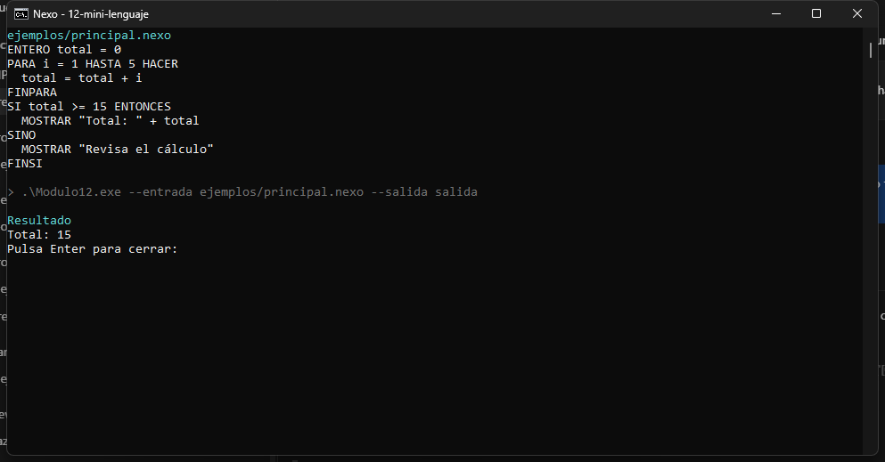

# 12 · Compilador de Mini lenguaje completo

Integra variables, operadores, decisiones, ciclos e impresión en un compilador pequeño.

**Nivel:** Avanzado. **Lenguaje destino:** C#. **Entrega:** Program.cs y ProgramaGenerado.csproj (consola).

## Abrir en Visual Studio

Instala Visual Studio 2022 17.8 o posterior y la carga de trabajo Desarrollo de escritorio de .NET, con SDK .NET 8 o posterior. Abre **Modulo12.sln**, establece Modulo12 como proyecto de inicio y pulsa Ctrl+F5. No requiere paquetes NuGet de terceros, cuentas ni API key. La primera restauración puede descargar las referencias de .NET.

Este proyecto es el **compilador**, una aplicación de consola. El código que produce se guarda aparte. Puedes copiar toda esta carpeta: incluye su propio motor y no depende de los otros módulos.

## Ejecutar desde terminal

Desde esta carpeta:

```powershell
dotnet build Modulo12.sln
dotnet run --project Modulo12.csproj
dotnet run --project Modulo12.csproj -- --entrada ejemplos/alternativo.nexo --salida salida
dotnet run --project Modulo12.csproj -- --pruebas
```

Sin argumentos se lee ejemplos/principal.nexo desde el directorio del ejecutable; los ejemplos se copian al compilar. Para un archivo propio, usa --entrada. --salida admite otra carpeta. --ayuda muestra las opciones. Un error escribe un diagnóstico y devuelve código de salida 1; una compilación válida devuelve 0.

## Ejemplo del módulo

```text
ENTERO total = 0
PARA i = 1 HASTA 5 HACER
  total = total + i
FINPARA
SI total >= 15 ENTONCES
  MOSTRAR "Total: " + total
SINO
  MOSTRAR "Revisa el cálculo"
FINSI
```

Resultado esperado:

```text
Total: 15
```

Ejecuta el ejemplo y sigue las cinco etapas. Construye una suma de 1 a 10 y muestra un mensaje según el resultado.

## Gramática y reglas

Una instrucción por línea: `IMPRIMIR expresión`, `MOSTRAR expresión`, `ENTERO`, `DECIMAL`, `TEXTO`, `BOOLEANO`, asignaciones, `SI … ENTONCES / SINO / FINSI`, `MIENTRAS … HACER / FINMIENTRAS`, `PARA i = inicio HASTA fin HACER / FINPARA`, `REPETIR / HASTA condición`. El final de PARA es inclusivo y el incremento es 1. Operadores: `+ - * / %`, comparaciones, `Y`, `O`, `NO`. Usa `DECIMAL` para división con decimales.

El motor comprueba nombres y tipos en las instrucciones ejecutadas. ENTERO corresponde a int de 32 bits; DECIMAL a double; TEXTO a string; BOOLEANO a bool. La división de dos enteros produce división entera, como C#. Las variables tienen alcance de bloque. No es un analizador semántico exhaustivo de ramas sin ejecutar.

## Archivos generados y las cinco etapas

1. Código: se lee el archivo .nexo UTF-8.
2. Tokens: tokens.txt muestra las piezas reconocidas.
3. Estructura: arbol.json contiene el AST o la estructura específica del documento.
4. Generación: Program.cs y ProgramaGenerado.csproj (consola).
5. Resultado: resultado.txt conserva la salida o los datos de ejemplo.

Program.cs contiene la CLI y la publicación; CompilerEngine.cs implementa las fases; ejemplos/ contiene entradas reproducibles y casos automatizados. Puedes depurar Lex, Parser, Interpreter y Generate con puntos de interrupción.

## Generar y ejecutar el .exe

```powershell
dotnet run --project Modulo12.csproj -- --exe
.\salida\binario\ProgramaGenerado.exe
```

--exe invoca dotnet publish para win-x64 y genera un ejecutable dependiente del runtime .NET 8. Requiere Windows para ejecutarlo. También puedes abrir salida/ProgramaGenerado.csproj en Visual Studio. Para distribuir con runtime incluido, ejecuta dotnet publish salida/ProgramaGenerado.csproj -c Release -r win-x64 --self-contained true -o salida/distribucion. El generador no ejecuta automáticamente el binario.

## Pruebas, límites y errores

--pruebas ejecuta ejemplos/casos.json: resultado principal, alternativa y rechazo de entrada vacía. Los errores de sintaxis, tipos, claves duplicadas y división por cero se notifican; no se silencian. Límites: 30 000 caracteres, 4000 tokens, 80 niveles de anidación y 10 000 pasos para los programas interpretados. No hay entrada interactiva, funciones, arrays ni acceso a archivos desde el mini lenguaje. --exe solo compila el C# que este motor genera.

## Ejercicio propuesto

Construye una suma de 1 a 10 y muestra un mensaje según el resultado.

El analizador reconoce las instrucciones de este módulo y construye su estructura. El generador produce C# a partir de esa estructura, conservando los textos y valores.

Al abrir el compilador o el programa de consola generado con doble clic, la ventana espera una tecla antes de cerrarse. Desde una terminal existente o con salida redirigida, termina sin esa espera. Vuelve a generar el `.exe` para aplicar este cambio.

## Captura de funcionamiento

Entrada del ejemplo principal y resultado de su ejecución.


